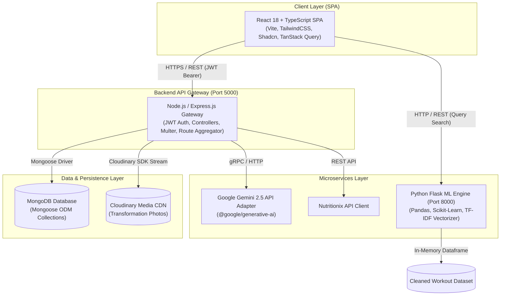
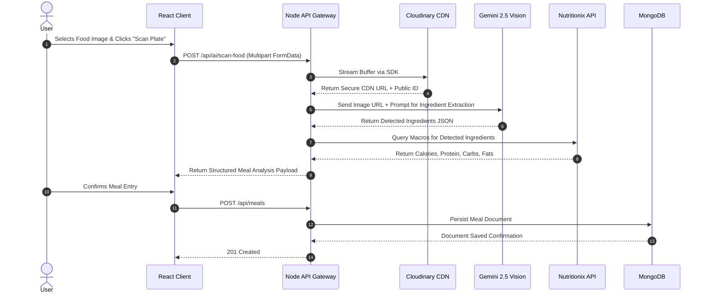

# 🏛️ FitTrack - System Architecture & Microservices Design

> **Author**: Daksh Gupta (Full Stack & AI Software Engineer)  
> **Target Standard**: FAANG Level 5 System Design & Architecture Spec  
> **Pattern**: Decoupled Event-Driven Microservices Architecture  

---

## 1. High-Level System Architecture Diagram

---

## 2. Architectural Principles & Patterns

### A. Decoupled Microservice Boundaries
FitTrack strictly separates operational concerns into domain-specific services:
- **Core Node.js Gateway**: Handles authentication, resource CRUD operations, database transactions, image streaming, and third-party orchestration.
- **Python ML Recommender**: Operates as a stateless compute service optimized for CPU-bound matrix mathematical calculations (TF-IDF & Cosine Similarity) over large exercise vector spaces.
- **React Client**: Renders UI statelessly based on server data fetched through TanStack Query caches.

### B. Security-First Gateway Pattern
External third-party API credentials (Google Gemini, Nutritionix, Cloudinary) are isolated inside the Node.js server environment variables (`.env`). The client browser never receives or stores raw third-party keys.

---

## 3. Subsystem Breakdown

### 1. Frontend Client Architecture (`/frontend`)
- **Single Page Application (SPA)** powered by **React 18**, **TypeScript 5**, and **Vite 6**.
- **State Hydration**: Uses **React Context (`AuthContext`)** for JWT session state and **TanStack Query (v5)** for optimistic UI updates, polling, and REST response caching.
- **Spatial Visualization**: **React-Leaflet** queries **OpenStreetMap Overpass API** for spatial bounding-box amenity extraction.
- **Data Analytics Charts**: **Recharts** handles real-time visual rendering of physiological time-series metrics.

### 2. Primary API Gateway (`/backend`)
- **Runtime**: Node.js utilizing native ES Modules (`import/export`).
- **Middleware Chain**:
  - `cors`: Configured with explicit origin whitelisting.
  - `auth.middleware.js`: Extracts `Authorization: Bearer <token>`, verifies JWT signature, attaches sanitized user instance to `req.user`.
  - `upload.middleware.js`: Handles `multipart/form-data` using Multer memory storage buffers.
  - `errorHandler.js`: Intercepts unhandled exceptions and formats standard JSON error structures.

### 3. Machine Learning Recommendation Service (`/python`)
- **Runtime**: Python 3.10+ with Flask micro-framework.
- **Algorithm**:
  1. Tokenizes user search string (e.g. `"chest dumbbell beginner"`).
  2. Executes string regex parsing across `BodyPart`, `Equipment`, and `Level` feature matrices.
  3. Transforms title strings into n-gram Term Frequency-Inverse Document Frequency (TF-IDF) feature vectors.
  4. Calculates **Cosine Similarity** matrix against dataset embeddings:
     $$\text{Similarity}(A, B) = \frac{A \cdot B}{\|A\| \|B\|}$$
  5. Sorts and returns top-ranked exercise cards.

---

## 4. End-to-End Event Sequences

### Sequence A: Smart Computer Vision Food Logging Flow

---

## 5. Non-Functional Requirements & SLA Benchmarks

| Metric | Target SLA | Strategy |
| :--- | :--- | :--- |
| **API Response Time (p95)** | `< 120ms` | MongoDB Indexing on `user` foreign keys |
| **ML Inference Latency** | `< 45ms` | In-memory Pandas dataframe loading on startup |
| **Auth Session Duration** | `30 Days` | Stateless Signed JWT with HTTP Bearer validation |
| **Uptime Target** | `99.9%` | Multi-container microservice isolated deployment |
