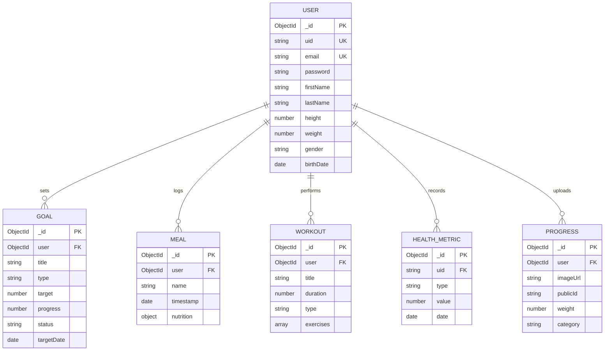

# 🗄️ FitTrack - Database Schema & Data Models Specification

> **Database Engine**: MongoDB v7.0+  
> **ODM**: Mongoose v8.x  
> **Design Pattern**: Domain-Driven Design (DDD) with Compound Indexing & Referential Integrity

---

## 📐 Entity Relationship & Data Architecture

FitTrack implements a normalized-hybrid NoSQL document schema design. Core entities maintain foreign key references (`mongoose.Schema.Types.ObjectId`) pointing to the primary `User` collection.



---

## 📑 Collection Specifications

### 1. `User` Collection (`users`)

Stores user identity, salted Bcrypt authentication credentials, physical attributes, and localized interface preferences.

#### Schema Implementation (`models/user.model.js`)

| Field Name | Type | Constraints | Description |
| :--- | :--- | :--- | :--- |
| `_id` | `ObjectId` | Primary Key | Auto-generated MongoDB ObjectId |
| `uid` | `String` | Unique, Indexed | External/Firebase UID alias |
| `email` | `String` | Required, Unique, Lowercase | Primary auth credential |
| `password` | `String` | Required, `select: false` | Salted Bcrypt hash (10 rounds) |
| `firstName` | `String` | Required, Trimmed | User's first name |
| `lastName` | `String` | Required, Trimmed | User's last name |
| `height` | `Number` | Min: 50, Max: 300 | Height in centimeters |
| `weight` | `Number` | Min: 20, Max: 500 | Current body weight in kg |
| `gender` | `String` | Enum: `['male', 'female', 'other', 'prefer_not_to_say']` | Physical biological category |
| `notifications`| `Object` | Nested Schema | Reminder & email notification settings |

---

### 2. `Goal` Collection (`goals`)

Tracks user objectives, target numerical values, deadline constraints, and sub-milestones.

| Field Name | Type | Constraints | Description |
| :--- | :--- | :--- | :--- |
| `_id` | `ObjectId` | Primary Key | Unique document ID |
| `user` | `ObjectId` | Required, Ref: `User` | Foreign key referencing `User` |
| `type` | `String` | Enum: `['weight', 'workout', 'nutrition', 'habit', 'strength', 'hydration', 'steps']` | Target classification |
| `title` | `String` | Required, Max: 100 chars | Goal description |
| `target` | `Number` | Required, Positive | Numerical target goal |
| `unit` | `String` | Required | Unit of measurement (kg, lbs, steps, kcal) |
| `status` | `String` | Enum: `['active', 'completed', 'failed']` | Current status flag |
| `milestones` | `Array` | Sub-documents | Sub-task checklist (`title`, `isCompleted`) |

---

### 3. `Meal` Collection (`meals`)

Logs nutritional intake, timestamps, macronutrient splits (protein, carbohydrates, fats), and Vision AI metadata.

| Field Name | Type | Constraints | Description |
| :--- | :--- | :--- | :--- |
| `_id` | `ObjectId` | Primary Key | Unique meal document ID |
| `user` | `ObjectId` | Required, Ref: `User` | Foreign key referencing `User` |
| `name` | `String` | Required | Dish or meal title |
| `timestamp` | `Date` | Default: `Date.now` | Consumed date & time |
| `nutrition.calories` | `Number` | Min: 0 | Total kilocalories (kcal) |
| `nutrition.protein`  | `Number` | Min: 0 | Protein in grams |
| `nutrition.carbs`    | `Number` | Min: 0 | Carbohydrates in grams |
| `nutrition.fat`      | `Number` | Min: 0 | Dietary fats in grams |

---

### 4. `Workout` Collection (`workouts`)

Stores logged workout routines, exercise intensity, duration, targeted muscle groups, and calorie expenditures.

| Field Name | Type | Constraints | Description |
| :--- | :--- | :--- | :--- |
| `_id` | `ObjectId` | Primary Key | Unique workout ID |
| `user` | `ObjectId` | Required, Ref: `User` | Foreign key referencing `User` |
| `title` | `String` | Required | Name of workout session |
| `type` | `String` | Enum: `['Strength', 'Cardio', 'Flexibility', 'Other']` | Activity domain |
| `duration` | `Number` | Required, Positive | Session time in minutes |
| `estimatedCalories`| `Number` | Default: 0 | Calculated energy expenditure |
| `exercises` | `Array` | Sub-documents | Array of `{ name, sets, reps, weight }` |

---

### 5. `Progress` Collection (`progress`)

Manages body transformation progress pictures uploaded to Cloudinary, along with historical body metric snapshots.

| Field Name | Type | Constraints | Description |
| :--- | :--- | :--- | :--- |
| `_id` | `ObjectId` | Primary Key | Unique document ID |
| `user` | `ObjectId` | Required, Ref: `User` | Foreign key referencing `User` |
| `imageUrl` | `String` | Required | Cloudinary secure CDN URL |
| `publicId` | `String` | Required | Cloudinary asset removal ID |
| `category` | `String` | Enum: `['Front', 'Back', 'Side']` | Photo pose angle |
| `weight` | `Number` | Optional | Body weight snapshot at upload time |
| `date` | `Date` | Default: `Date.now` | Capture timestamp |

---

## 🚀 Performance Indexing Strategy

To guarantee sub-10ms query speeds under heavy production loads, the following MongoDB indexes are created:

```javascript
// User lookups by Email
UserSchema.index({ email: 1 }, { unique: true });

// Fast querying of user time-series data
MealSchema.index({ user: 1, timestamp: -1 });
WorkoutSchema.index({ user: 1, date: -1 });
HealthMetricSchema.index({ uid: 1, date: -1 });
GoalSchema.index({ user: 1, status: 1 });
```
