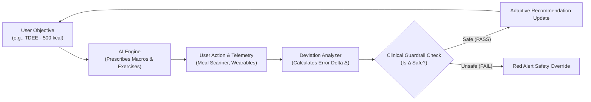
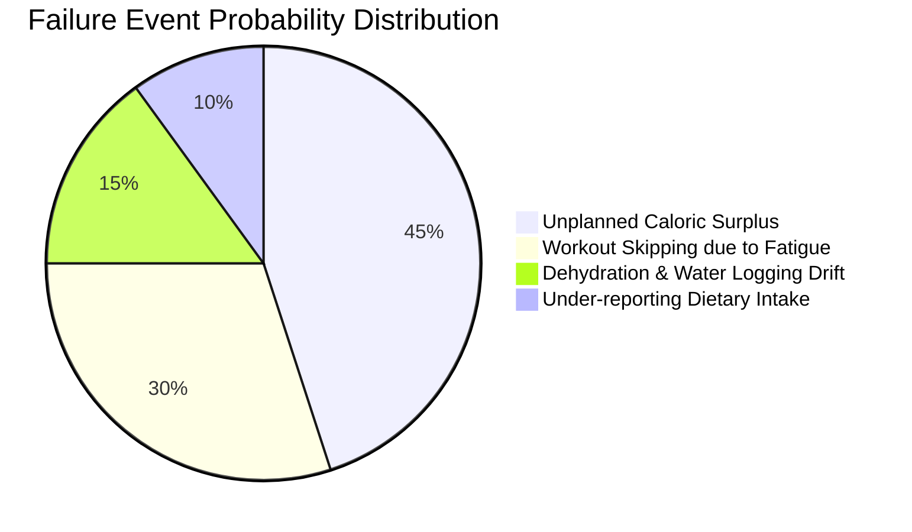

# 🧠 FitTrack - Expert AI Health System & Telemetry Engine Design

> **Author**: Daksh Gupta  
> **System Classification**: Closed-Loop Adaptive Behavioral Control Engine  
> **Safety Protocol**: Clinical-Grade Guardrail Architecture  

---

## 1. Mathematical Closed-Loop Feedback Model

FitTrack operates on a control-theory **Closed-Loop Feedback** model to continuously optimize health outcomes while enforcing clinical safety thresholds.



### Telemetry Formulation
Let Maintenance Caloric Energy be denoted as $TDEE$, target daily caloric deficit as $D$, and actual logged intake as $C_{\text{actual}}$.
The daily energy balance error $\Delta E$ is defined as:

$$\Delta E = C_{\text{actual}} - (TDEE - D)$$

- If $\Delta E > +500\text{ kcal}$ consistently over 3 days $\implies$ System triggers **Binge-Compensation Protocol**.
- If $C_{\text{actual}} < 1200\text{ kcal}$ $\implies$ System triggers **Starvation Safety Intercept**.

---

## 2. Daily Telemetry Telematics Matrix

Below is an automated daily compliance evaluation table executed at `00:00 UTC` for each active user profile:

| Metric Category | Target Value | Actual Telemetry | Delta ($\Delta$) | Status Indicator | Automated System Action |
| :--- | :--- | :--- | :--- | :--- | :--- |
| **Total Energy** | `2,100 kcal` | `3,400 kcal` | **`+1,300 kcal`** | 🔴 Non-Compliant | Recalculate weekly macro deficit; adjust fiber guidance |
| **Protein Intake** | `165 g` | `90 g` | **`-75 g`** | 🔴 Non-Compliant | Push high-leucine protein meal suggestions |
| **Active Minutes** | `45 mins` | `10 mins` | **`-35 mins`** | 🟡 Partial | Suggest low-impact 15-minute evening walk |
| **Resting HR** | `62 bpm` | `78 bpm` | **`+16 bpm`** | 🔴 Elevation Flag | Enforce mandatory active recovery day |

---

## 3. Failure Mode & Effects Analysis (FMEA)



| Failure Mode | Root Cause | Physiological Impact | AI System Recovery Strategy |
| :--- | :--- | :--- | :--- |
| **Binge Episode (> 4000 kcal)** | Emotional stress / Restrictive diet | Acute glycogen saturation, lipid storage spike | **Compassionate Neutrality Protocol**: Block guilt messaging, prescribe 35g fiber + 3L hydration for next 24h. |
| **Workout Omission** | Fatigue / Lack of time | Reduced insulin sensitivity | Auto-reschedule session to next day; reduce volume by 25%. |
| **Zero Hydration Logged** | Tracking friction | Perceived hunger, metabolic sluggishness | Trigger non-intrusive water tracker widget notification. |

---

## 4. Multi-Layer Clinical Risk Management Matrix

| Risk Scenario | Risk Source | Trigger Condition | Severity | System Action |
| :--- | :--- | :--- | :--- | :--- |
| **Extreme Deficit** | User Preference | User sets target $< 1,200\text{ kcal}$ | 🚨 CRITICAL | **Hard Guardrail Intercept**: Block prompt execution; enforce 1,200 kcal floor. |
| **Overtraining Syndrome** | AI Recommendation | 6 consecutive heavy strength days | ⚠️ HIGH | **Rest Day Injection**: Automatically replace Day 7 with "Flexibility & Foam Rolling". |
| **Hallucinated Detox Diets** | LLM Output | Gemini suggests unsafe fasts | 🚨 CRITICAL | **Regex Filter**: Intercept response containing terms like `"arsenic detox"`, `"water fast 7 days"`. |

---

## 5. Implementation Architecture for Guardrails

```javascript
// Example Safety Middleware (backend/middleware/safety.middleware.js)
export const enforceClinicalGuardrails = (req, res, next) => {
  const { calories, protein } = req.body;
  
  // Enforce Minimum Caloric Floor
  if (calories && calories < 1200) {
    return res.status(400).json({
      success: false,
      error: "SAFETY_INTERCEPT: Caloric intake recommendations cannot fall below 1,200 kcal/day to prevent metabolic degradation."
    });
  }
  next();
};
```
