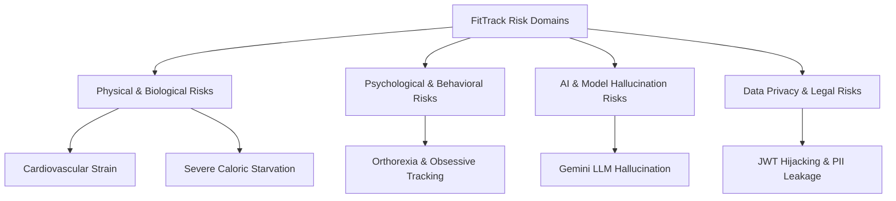
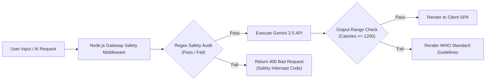

# 🛡️ FitTrack - AI Safety & Risk Management Specification

> **Target Standard**: FAANG Level 5 AI Ethics & Clinical Safety Framework  
> **Document Version**: `v1.0.0`  
> **Compliance**: HIPAA / WHO Guidance Alignment  

---

## 1. System Risk Taxonomy

FitTrack categorizes operational risks into four primary domain buckets:

---

## 2. Risk Severity Assessment Matrix

| Risk ID | Hazard Event | Root Cause | Impact | Likelihood | Risk Score | Mitigation Strategy |
| :--- | :--- | :--- | :--- | :--- | :--- | :--- |
| **RSK-01** | **Extreme Caloric Deficit** | User sets target $< 1,200\text{ kcal}$ | Severe | High | 🔴 **CRITICAL** | Hardcode minimum caloric floor ($1,200\text{ female} / 1,500\text{ male}$) in backend validation. |
| **RSK-02** | **AI Workout Injury** | Recommending heavy deadlifts to beginner with back injury | High | Medium | 🟠 **HIGH** | Algorithmic pre-filtering: Exclude `Level: Expert` if user profile contains medical flags. |
| **RSK-03** | **LLM Hallucination** | Gemini suggests dangerous fasts or unverified detoxes | High | Low | 🟠 **HIGH** | Implement Regex Guardrails in Node.js Gateway; intercept non-standard dietary advice. |
| **RSK-04** | **PII Data Intercept** | JWT token theft via XSS/CSRF | Medium | Low | 🟡 **MEDIUM** | Issue HTTP-only, Secure, SameSite cookies for JWT storage; enforce HTTPS everywhere. |

---

## 3. Automated Guardrail Architecture

---

## 4. Operational Safety Directives

1. **Directive 0 (Primary Mandate)**: Physiological safety overrides user preference in all scenarios.
2. **Directive 1 (Caloric Floor)**: The API shall return an HTTP `400` error if any prescription calculates a daily caloric budget under `1,200 kcal`.
3. **Directive 2 (Mandatory Rest Days)**: Training programs generated by the Python ML service must include at least 1 rest day per 4 training sessions.
4. **Directive 3 (Medical Disclaimer)**: Every AI response must include the footer: *"FitTrack AI recommendations are for informational purposes and do not replace professional medical advice."*
