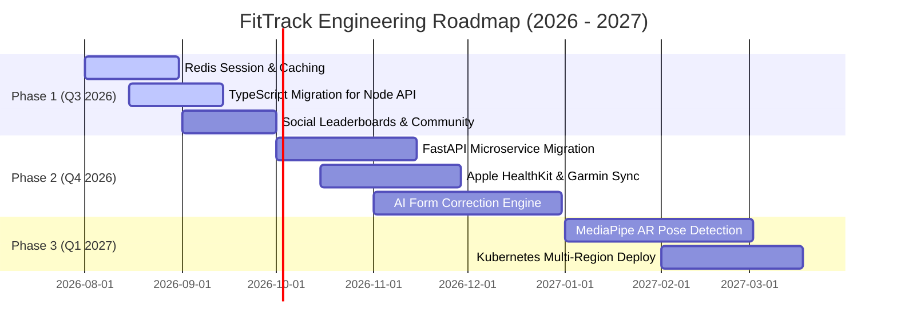

# 🚀 FitTrack - Technical Engineering Roadmap & Architecture Evolution

> **Target Standard**: FAANG Level 5 Engineering Roadmap  
> **Maintainer**: Daksh Gupta  
> **Horizon**: 2026 – 2027  

---

## 📅 Roadmap Overview & Execution Timeline

---

## 📑 Detailed Engineering Milestones

### 🟢 Phase 1: Infrastructure Optimization & Social Platform (Q3 2026)
- [x] **Monorepo Restructuring**: Clean microservices separation into Node Gateway, React SPA, and Python ML.
- [ ] **Redis Sub-System**: Implement Redis in-memory cache for fast user session lookups, API rate limiting, and frequent meal macro caching.
- [ ] **Social & Community Engine**: Add user friend connections, workout achievement feeds, and competitive step leaderboards.

### 🟡 Phase 2: Python FastAPI Transition & Wearables (Q4 2026)
- [ ] **FastAPI Migration**: Upgrade Python ML engine from Flask to **FastAPI** to enable asynchronous concurrency (`async/await`) and Pydantic schema validation.
- [ ] **Wearable SDK Integration**: Direct integration with Apple HealthKit, Google Health Connect, and Garmin Health APIs for automated background sync.

### 🔴 Phase 3: Edge AI & Computer Vision Form Correction (Q1 2027)
- [ ] **WebRTC / MediaPipe AR Pose Tracking**: Use Google MediaPipe in the frontend browser to track body joint angles during squats and deadlifts for real-time posture correction.
- [ ] **Multi-Region Cloud Deployment**: Containerize services with Docker and orchestrate with Kubernetes (EKS/GKE).
