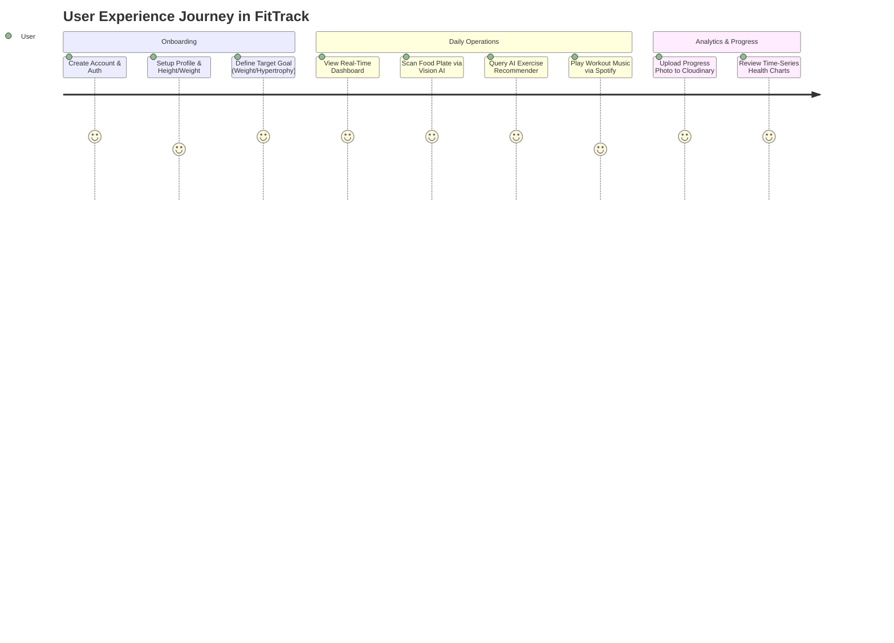

# 📖 FitTrack - End-to-End User Experience & System Walkthrough

> **Target Standard**: FAANG User Experience & System Architecture Walkthrough  
> **Author**: Daksh Gupta  

---

## 🗺️ Complete User Journey Flow

---

## 📱 Step-by-Step Functional Walkthrough

### 1. Registration & Authentication
1. Navigate to `http://localhost:5173/signup`.
2. Input first name, last name, email, and password.
3. Upon registration, the Node.js Gateway generates a signed stateless JWT token stored in browser `localStorage`.
4. The user is automatically redirected to the **Dashboard**.

### 2. Smart Computer Vision Meal Logging
1. Select **Meals** from the primary navigation bar.
2. Click **AI Scan Food** button and upload a meal photo.
3. Gemini 2.5 Vision identifies constituent food ingredients and queries Nutritionix for caloric and macronutrient values.
4. Review the parsed nutrition breakdown and click **Log Meal** to record in MongoDB.

### 3. Machine Learning Workout Generation
1. Select **Workouts** from the navigation bar.
2. Enter a natural language prompt in the search bar (e.g. *"beginner leg workout with dumbbells"*).
3. The Python ML service tokenizes the query, calculates Cosine Similarity over exercise vectors, and returns ranked exercise cards.

### 4. Interactive Gym Search
1. Open **Nearby Gyms** page.
2. Grant browser Geolocation permissions.
3. React-Leaflet maps query OpenStreetMap Overpass API and display nearby fitness amenities with Google Maps directions links.
