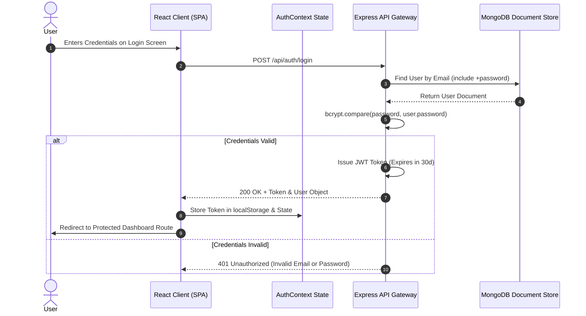
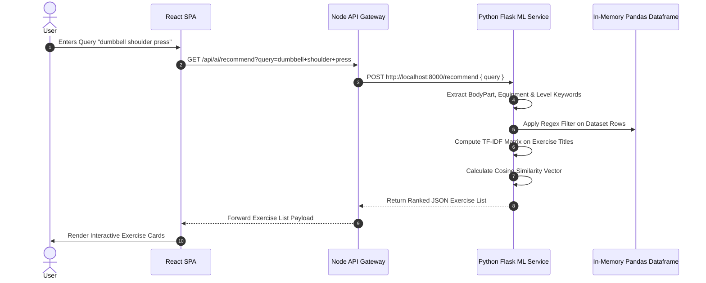

# ⚙️ FitTrack - Internal System Mechanics & Execution Mechanics

> **Target Standard**: FAANG Engineering Internal Mechanics Spec  
> **Author**: Daksh Gupta  

---

## 1. Authentication Sequence & Session Security

---

## 2. Vector Space ML Recommendation Engine Mechanics

---

## 3. Dynamic Health Metric Aggregation Engine

When a user opens the **Dashboard**, the frontend concurrently requests multiple time-series endpoints:
1. `GET /api/health-metrics/summary`: Returns latest blood pressure, resting heart rate, and sleep duration.
2. `GET /api/meals/today`: Calculates total consumed calories and macronutrients ($\text{Protein}, \text{Carbs}, \text{Fat}$).
3. `GET /api/workouts/today`: Sums active minutes and estimated caloric expenditure.

The system computes real-time Basal Metabolic Rate (BMR) using the **Mifflin-St Jeor Equation**:

$$\text{BMR}_{\text{male}} = (10 \times \text{weight}) + (6.25 \times \text{height}) - (5 \times \text{age}) + 5$$

$$\text{BMR}_{\text{female}} = (10 \times \text{weight}) + (6.25 \times \text{height}) - (5 \times \text{age}) - 161$$

Recharts uses this aggregated data to render real-time caloric balance graphs.
